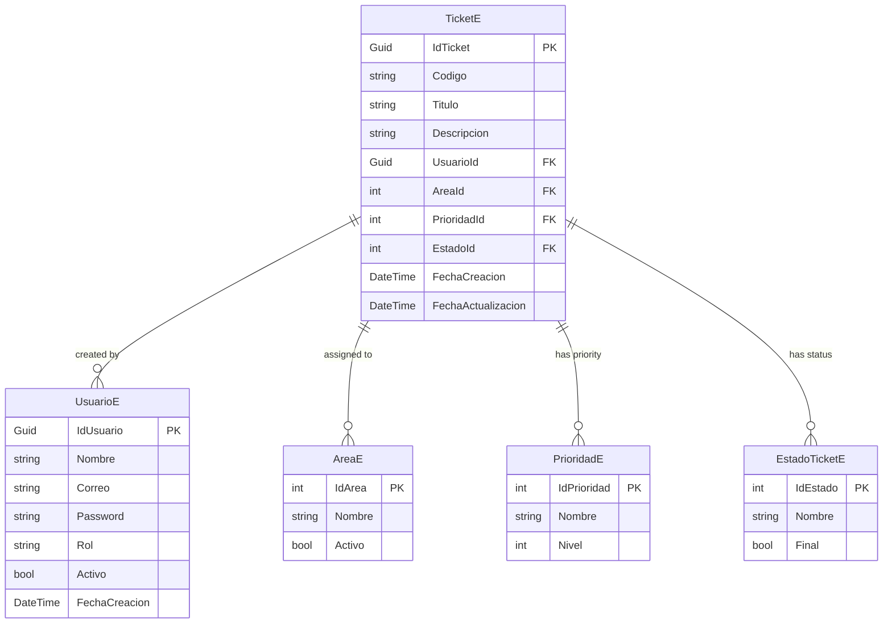

## Introduction

The Domain layer contains all entity models that represent the business domain. These entities are mapped to PostgreSQL database tables using Entity Framework Core annotations.

<Note>
Entities in the Domain layer are pure POCO (Plain Old CLR Objects) classes with minimal dependencies, ensuring the business logic remains independent of infrastructure concerns.
</Note>

---

## Entity Overview

ApiTickets has five core entity models:

<CardGroup cols={2}>
  <Card title="TicketE" icon="ticket">
    Main ticket entity with tracking information
  </Card>
  <Card title="UsuarioE" icon="user">
    User entity with authentication details
  </Card>
  <Card title="AreaE" icon="building">
    Department/area catalog for ticket classification
  </Card>
  <Card title="PrioridadE" icon="circle-exclamation">
    Priority levels for tickets
  </Card>
  <Card title="EstadoTicketE" icon="list-check">
    Ticket status/state definitions
  </Card>
</CardGroup>

---

## TicketE Entity

The main entity representing support tickets in the system.

### Location
```plaintext
Domain/Entities/TicketE/TicketE.cs
```

### Entity Definition

```csharp
using System.ComponentModel.DataAnnotations;
using System.ComponentModel.DataAnnotations.Schema;

namespace Domain.Entities.TicketE
{
    [Table("tickets")]
    public class TicketE
    {
        [Key]
        [Column("id_ticket")]
        public Guid? IdTicket { get; set; } = Guid.NewGuid();

        [Column("codigo_seguimiento")]
        public required string Codigo { get; set; }

        [Column("titulo")]
        public required string Titulo { get; set; }

        [Column("descripcion")]
        public required string Descripcion { get; set; }

        [Column("id_usuario")]
        public required Guid UsuarioId { get; set; }

        [Column("id_area")]
        public required int AreaId { get; set; }

        [Column("id_prioridad")]
        public required int PrioridadId { get; set; }

        [Column("id_estado")]
        public required int EstadoId { get; set; }

        [Column("fecha_creacion")]
        public required DateTime FechaCreacion { get; set; }

        [Column("fecha_actualizacion")]
        public required DateTime FechaActualizacion { get; set; }
    }
}
```

### Properties

| Property | Type | Description |
|----------|------|-------------|
| `IdTicket` | `Guid?` | Unique identifier (primary key), auto-generated |
| `Codigo` | `string` | Tracking code for public reference (e.g., "001", "002") |
| `Titulo` | `string` | Ticket title/subject |
| `Descripcion` | `string` | Detailed ticket description |
| `UsuarioId` | `Guid` | Foreign key to UsuarioE (ticket creator) |
| `AreaId` | `int` | Foreign key to AreaE (department) |
| `PrioridadId` | `int` | Foreign key to PrioridadE (priority level) |
| `EstadoId` | `int` | Foreign key to EstadoTicketE (current status) |
| `FechaCreacion` | `DateTime` | Timestamp when ticket was created |
| `FechaActualizacion` | `DateTime` | Timestamp of last update |

<Info>
The `Codigo` field is generated using a PostgreSQL sequence (`ticket_numero_seq`) and formatted as a zero-padded string.
</Info>

---

## UsuarioE Entity

Represents system users with authentication and role information.

### Location
```plaintext
Domain/Entities/UsuarioE/UsuarioE.cs
```

### Entity Definition

```csharp
using System.ComponentModel.DataAnnotations;
using System.ComponentModel.DataAnnotations.Schema;

namespace Domain.Entities.UsuarioE
{
    [Table("usuarios")]
    public class UsuarioE
    {
        [Key]
        [Column("id_usuario")]
        public required Guid IdUsuario { get; set; }

        [Column("nombre")]
        public required string Nombre { get; set; } = null!;

        [Column("correo")]
        public required string Correo { get; set; } = null!;

        [Column("password_hash")]
        public required string Password { get; set; } = null!;

        [Column("rol")]
        public required string Rol { get; set; } = null!;

        [Column("activo")]
        public required bool Activo { get; set; } = true;

        [Column("fecha_creacion")]
        public DateTime FechaCreacion { get; set; }
    }
}
```

### Properties

| Property | Type | Description |
|----------|------|-------------|
| `IdUsuario` | `Guid` | Unique identifier (primary key) |
| `Nombre` | `string` | User's full name |
| `Correo` | `string` | User's email address (used for login) |
| `Password` | `string` | Hashed password (never stored in plain text) |
| `Rol` | `string` | User role (e.g., "Admin", "User", "Support") |
| `Activo` | `bool` | Whether the user account is active |
| `FechaCreacion` | `DateTime` | Account creation timestamp |

<Note>
Passwords are hashed using the `IPassword` utility from `Domain.Utilidades` before storage. The Password field stores the hash, never the plain text password.
</Note>

---

## Catalog Entities

Catalog entities provide reference data for ticket classification and management.

### AreaE (Department)

```csharp
namespace Domain.Entities.Catalogos
{
    [Table("areas")]
    public class AreaE
    {
        [Key]
        [Column("id_area")]
        public required int IdArea { get; set; }

        [Column("nombre")]
        public required string Nombre { get; set; }

        [Column("activo")]
        public required bool Activo { get; set; }
    }
}
```

**Purpose**: Defines departments or areas that handle tickets (e.g., IT, HR, Sales)

| Property | Type | Description |
|----------|------|-------------|
| `IdArea` | `int` | Unique identifier |
| `Nombre` | `string` | Department name |
| `Activo` | `bool` | Whether the area is active |

### PrioridadE (Priority)

```csharp
namespace Domain.Entities.Catalogos
{
    [Table("prioridades")]
    public class PrioridadE
    {
        [Key]
        [Column("id_prioridad")]
        public required int IdPrioridad { get; set; }

        [Column("nombre")]
        public required string Nombre { get; set; }

        [Column("nivel")]
        public required int Nivel { get; set; }
    }
}
```

**Purpose**: Defines priority levels for tickets (e.g., Low, Medium, High, Critical)

| Property | Type | Description |
|----------|------|-------------|
| `IdPrioridad` | `int` | Unique identifier |
| `Nombre` | `string` | Priority name (e.g., "Alta", "Media", "Baja") |
| `Nivel` | `int` | Numeric priority level for sorting |

### EstadoTicketE (Ticket Status)

```csharp
namespace Domain.Entities.Catalogos
{
    [Table("estados_ticket")]
    public class EstadoTicketE
    {
        [Key]
        [Column("id_estado")]
        public required int IdEstado { get; set; }

        [Column("nombre")]
        public required string Nombre { get; set; }

        [Column("es_final")]
        public required bool Final { get; set; }
    }
}
```

**Purpose**: Defines ticket states throughout their lifecycle

| Property | Type | Description |
|----------|------|-------------|
| `IdEstado` | `int` | Unique identifier |
| `Nombre` | `string` | Status name (e.g., "Abierto", "En Progreso", "Cerrado") |
| `Final` | `bool` | Whether this is a terminal state (e.g., Closed, Resolved) |

---

## DTOs vs Entities

The Domain layer includes both **Entities** (database models) and **DTOs** (Data Transfer Objects) for clean separation.

<CardGroup cols={2}>
  <Card title="Entities" icon="database">
    - Map directly to database tables
    - Include EF Core annotations
    - Used by Infrastructure layer
  </Card>
  <Card title="DTOs" icon="right-left">
    - Clean data structures for API
    - No database annotations
    - Used for serialization/deserialization
  </Card>
</CardGroup>

### DTO Example: TicketDto

```csharp
namespace Domain.DTOs.TicketD
{
    public class TicketDto
    {
        public Guid? IdTicket { get; set; }
        public string? Codigo { get; set; }
        public required string Titulo { get; set; }
        public required string Descripcion { get; set; }
        public required Guid UsuarioId { get; set; }
        public required int AreaId { get; set; }
        public required int PrioridadId { get; set; }
        public required int EstadoId { get; set; }
        public DateTime FechaCreacion { get; set; }
        public DateTime FechaActualizacion { get; set; }

        // Conversion method from Entity to DTO
        public static TicketDto CrearDTO(TicketE ticketE)
        {
            return new TicketDto
            {
                IdTicket = ticketE.IdTicket,
                Codigo = ticketE.Codigo,
                Titulo = ticketE.Titulo,
                Descripcion = ticketE.Descripcion,
                UsuarioId = ticketE.UsuarioId,
                AreaId = ticketE.AreaId,
                PrioridadId = ticketE.PrioridadId,
                EstadoId = ticketE.EstadoId,
                FechaCreacion = ticketE.FechaCreacion,
                FechaActualizacion = ticketE.FechaActualizacion,
            };
        }

        // Conversion method from DTO to Entity
        public static TicketE CrearE(TicketDto ticketDto)
        {
            return new TicketE
            {
                Codigo = ticketDto.Codigo,
                Titulo = ticketDto.Titulo,
                Descripcion = ticketDto.Descripcion,
                UsuarioId = ticketDto.UsuarioId,
                AreaId = ticketDto.AreaId,
                PrioridadId = ticketDto.PrioridadId,
                EstadoId = ticketDto.EstadoId,
                FechaCreacion = ticketDto.FechaCreacion,
                FechaActualizacion = ticketDto.FechaActualizacion,
            };
        }
    }
}
```

### Why Use DTOs?

<AccordionGroup>
  <Accordion title="API Contract Stability">
    DTOs provide a stable API contract independent of database schema changes. You can modify entities without breaking API consumers.
  </Accordion>
  
  <Accordion title="Security">
    DTOs prevent exposing sensitive entity properties (like password hashes) in API responses.
    
    ```csharp
    public class UsuarioDto
    {
        public Guid IdUsuario { get; set; }
        public string Nombre { get; set; }
        public string Correo { get; set; }
        public string Rol { get; set; }
        public bool Activo { get; set; }
        // Password is NOT included!
        
        public static UsuarioDto CreateDTO(UsuarioE usuarioE)
        {
            return new UsuarioDto
            {
                IdUsuario = usuarioE.IdUsuario,
                Nombre = usuarioE.Nombre,
                Correo = usuarioE.Correo,
                Rol = usuarioE.Rol,
                Activo = usuarioE.Activo
                // Password intentionally excluded
            };
        }
    }
    ```
  </Accordion>
  
  <Accordion title="Specialized Data Shapes">
    Different DTOs for different use cases (create, update, read).
    
    ```csharp
    // For creating new tickets
    public class CrearticketDto
    {
        public required string Titulo { get; set; }
        public required string Descripcion { get; set; }
        public required Guid UsuarioId { get; set; }
        public required int AreaId { get; set; }
        public required int PrioridadId { get; set; }
        public required int EstadoId { get; set; }
        // No ID or dates - those are set by the system
    }
    
    // For updating ticket status
    public class ActualizarEstadoTicketDto
    {
        public Guid Id { get; set; }
        public int EstadoId { get; set; }
        // Only the fields that can be updated
    }
    
    // For querying with joined data
    public class ConsultarTicketDto
    {
        public Guid? IdTicket { get; set; }
        public required string Titulo { get; set; }
        public required string Codigo { get; set; }
        public required string Descripcion { get; set; }
        public required string Area { get; set; }        // Joined from AreaE
        public required string Prioridad { get; set; }   // Joined from PrioridadE
        public required string Estado { get; set; }      // Joined from EstadoTicketE
        public DateTime FechaCreacion { get; set; }
        public DateTime FechaActualizacion { get; set; }
    }
    ```
  </Accordion>
  
  <Accordion title="Performance">
    DTOs can be optimized for specific queries without affecting the entity model.
  </Accordion>
</AccordionGroup>

---

## Entity Relationships

While Entity Framework Core can handle relationships via navigation properties, this implementation uses a lightweight approach with foreign keys only.



### Relationship Details

- **TicketE → UsuarioE**: Many tickets can be created by one user
- **TicketE → AreaE**: Many tickets can be assigned to one area/department
- **TicketE → PrioridadE**: Many tickets can have the same priority level
- **TicketE → EstadoTicketE**: Many tickets can be in the same status

<Info>
Relationships are maintained through foreign keys rather than navigation properties, keeping entities lightweight and reducing query complexity.
</Info>

---

## Database Context Registration

Entities are registered with Entity Framework Core in the Infrastructure layer:

```csharp
namespace Infrastructure
{
    public class DBContext : DbContext
    {
        // DbSets expose entities as queryable collections
        public virtual DbSet<UsuarioE> UsuarioEs { get; set; }
        public virtual DbSet<AreaE> AreaEs { get; set; }
        public virtual DbSet<PrioridadE> PrioridadEs { get; set; }
        public virtual DbSet<EstadoTicketE> EstadoTicketEs { get; set; }
        public virtual DbSet<TicketE> TicketEs { get; set; }
    }
}
```

---

## Entity Conventions

### Naming Conventions

<Steps>
  <Step title="Entity Classes">
    Entity classes end with `E` suffix (e.g., `TicketE`, `UsuarioE`)
  </Step>
  
  <Step title="DTO Classes">
    DTO classes end with `Dto` suffix (e.g., `TicketDto`, `UsuarioDto`)
  </Step>
  
  <Step title="Table Names">
    Database tables use lowercase with underscores (e.g., `tickets`, `estados_ticket`)
  </Step>
  
  <Step title="Column Names">
    Database columns use lowercase with underscores (e.g., `id_ticket`, `fecha_creacion`)
  </Step>
</Steps>

### Required Modifier

C# 11's `required` modifier ensures properties are initialized:

```csharp
public required string Titulo { get; set; }
```

This provides compile-time safety, ensuring all required properties are set when creating instances.

### Nullable Reference Types

```csharp
public Guid? IdTicket { get; set; } = Guid.NewGuid();  // Nullable, auto-generated
public required string Nombre { get; set; } = null!;   // Required, non-nullable
```

---

## Best Practices

<CardGroup cols={2}>
  <Card title="Immutable IDs" icon="lock">
    Use `Guid` for entity IDs to prevent collisions and improve security
  </Card>
  <Card title="Audit Fields" icon="clock">
    Always include `FechaCreacion` and `FechaActualizacion` timestamps
  </Card>
  <Card title="Soft Deletes" icon="trash-can">
    Use `Activo` boolean flag instead of hard deletes where appropriate
  </Card>
  <Card title="Validation" icon="shield-check">
    Use Data Annotations for basic validation at the entity level
  </Card>
</CardGroup>

<Note>
For complex business validation rules, implement them in the Application or Domain services layer rather than in entity classes.
</Note>

---

## Next Steps

<CardGroup cols={2}>
  <Card title="Architecture Overview" icon="sitemap" href="/architecture/overview">
    Understand the overall Clean Architecture structure
  </Card>
  <Card title="Layer Details" icon="layer-group" href="/architecture/layers">
    Learn about each architectural layer
  </Card>
  <Card title="Database Setup" icon="database" href="/configuration/database">
    Set up PostgreSQL and run migrations
  </Card>
  <Card title="API Reference" icon="book" href="/api/tickets/create">
    Explore the REST API endpoints
  </Card>
</CardGroup>