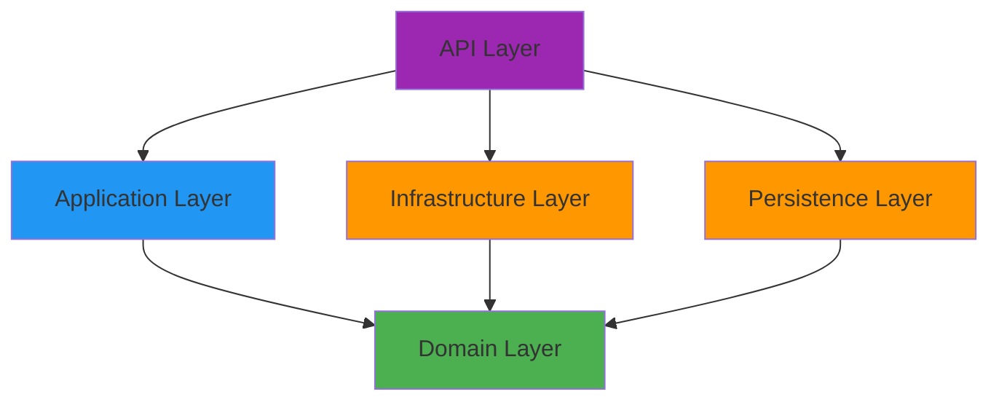

## Introduction

ApiTickets is built using **Clean Architecture** principles, ensuring separation of concerns, maintainability, and testability. The architecture is organized into four distinct layers, each with specific responsibilities and dependencies flowing inward toward the domain.

<Note>
Clean Architecture keeps business logic independent of frameworks, databases, and external agencies. This makes the codebase more maintainable, testable, and adaptable to change.
</Note>

## Architecture Principles

The ApiTickets project follows these core Clean Architecture principles:

<CardGroup cols={2}>
  <Card title="Dependency Rule" icon="arrow-down">
    Dependencies point inward. Outer layers depend on inner layers, never the reverse.
  </Card>
  <Card title="Domain Independence" icon="shield">
    Business logic is independent of frameworks, UI, databases, and external services.
  </Card>
  <Card title="Separation of Concerns" icon="layer-group">
    Each layer has a distinct responsibility and clear boundaries.
  </Card>
  <Card title="Testability" icon="vial">
    Business logic can be tested without UI, database, or external dependencies.
  </Card>
</CardGroup>

## Four-Layer Structure



### Layer Hierarchy

<Steps>
  <Step title="Domain Layer (Core)">
    Contains business entities, DTOs, and domain logic. Has no dependencies on other layers.
    
    **Location**: `/Domain`
    
    - Entity models (TicketE, UsuarioE, CatalogoE)
    - DTOs for data transfer
    - Domain utilities (Password hashing)
  </Step>
  
  <Step title="Application Layer">
    Orchestrates the application flow and dependency injection setup.
    
    **Location**: `/API/Application`
    
    - Dependency injection configuration
    - JWT authentication setup
    - Service registrations
  </Step>
  
  <Step title="Infrastructure Layer">
    Implements external concerns like database context and security.
    
    **Location**: `/Infrastructure`
    
    - DBContext (Entity Framework)
    - JWT token generation
    - PostgreSQL configuration
  </Step>
  
  <Step title="Persistence Layer">
    Handles data access through queries and commands (CQRS pattern).
    
    **Location**: `/Persistence`
    
    - Query classes (read operations)
    - Command classes (write operations)
    - Repository implementations
  </Step>
</Steps>

## Dependency Flow

The dependency flow ensures that the Domain layer remains pure and independent:

```csharp
// Domain Layer - No dependencies
namespace Domain.Entities.TicketE
{
    [Table("tickets")]
    public class TicketE
    {
        [Key]
        [Column("id_ticket")]
        public Guid? IdTicket { get; set; } = Guid.NewGuid();
        
        [Column("titulo")]
        public required string Titulo { get; set; }
        
        [Column("descripcion")]
        public required string Descripcion { get; set; }
        // ... more properties
    }
}
```

```csharp
// Persistence Layer - Depends on Domain and Infrastructure
using Domain.DTOs.TicketD;
using Domain.Entities.TicketE;
using Infrastructure;

namespace Persistence.Queries
{
    public class TicketQueries : ITicketQueries
    {
        private readonly DBContext _contexto;
        
        public async Task<List<TicketDto>> ObtenerTicketsAsync()
        {
            var tickets = await _contexto.TicketEs
                .AsNoTracking()
                .Select(a => TicketDto.CrearDTO(a))
                .ToListAsync();
            return tickets;
        }
    }
}
```

## Benefits of This Architecture

<AccordionGroup>
  <Accordion title="Maintainability">
    Clear separation makes it easy to locate and modify code. Changes in one layer don't cascade to others.
  </Accordion>
  
  <Accordion title="Testability">
    Business logic in the Domain layer can be tested independently without databases or external services.
  </Accordion>
  
  <Accordion title="Flexibility">
    Easy to swap implementations (e.g., change from PostgreSQL to SQL Server) without touching business logic.
  </Accordion>
  
  <Accordion title="Scalability">
    CQRS pattern in Persistence layer allows independent scaling of read and write operations.
  </Accordion>
  
  <Accordion title="Team Collaboration">
    Different teams can work on different layers simultaneously with minimal conflicts.
  </Accordion>
</AccordionGroup>

## Project Structure

```plaintext
ApiTickets/
├── API/                          # Presentation Layer
│   ├── Controllers/              # REST API endpoints
│   ├── Application/              # DI & configuration
│   └── Program.cs                # Application entry point
├── Domain/                       # Core business layer
│   ├── Entities/                 # Business entities
│   ├── DTOs/                     # Data transfer objects
│   └── Utilidades/               # Domain utilities
├── Infrastructure/               # External services
│   ├── DBContext.cs              # EF Core context
│   └── Seguridad/                # JWT security
└── Persistence/                  # Data access
    ├── Queries/                  # Read operations (CQRS)
    └── Commands/                 # Write operations (CQRS)
```

## CQRS Pattern Implementation

The Persistence layer implements the **CQRS** (Command Query Responsibility Segregation) pattern:

- **Queries**: Handle read operations (GET requests)
- **Commands**: Handle write operations (POST, PUT, DELETE requests)

This separation allows for:
- Optimized read and write models
- Independent scaling
- Clearer code organization
- Better performance tuning

<Info>
For detailed information about each layer, see the [Layers documentation](/architecture/layers).

To learn about the entity models, visit [Entities documentation](/architecture/entities).
</Info>

## Next Steps

<CardGroup cols={2}>
  <Card title="Layer Details" icon="layer-group" href="/architecture/layers">
    Explore each layer's responsibilities and implementation
  </Card>
  <Card title="Entity Models" icon="database" href="/architecture/entities">
    Learn about domain entities and their relationships
  </Card>
</CardGroup>